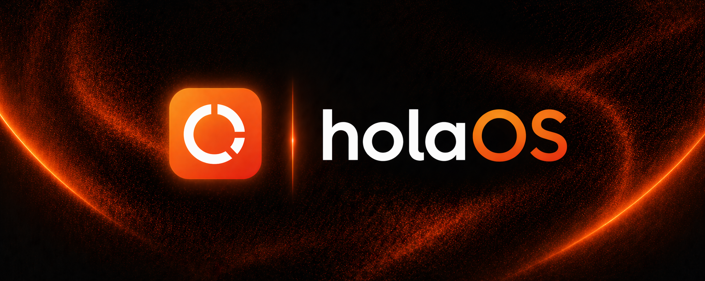
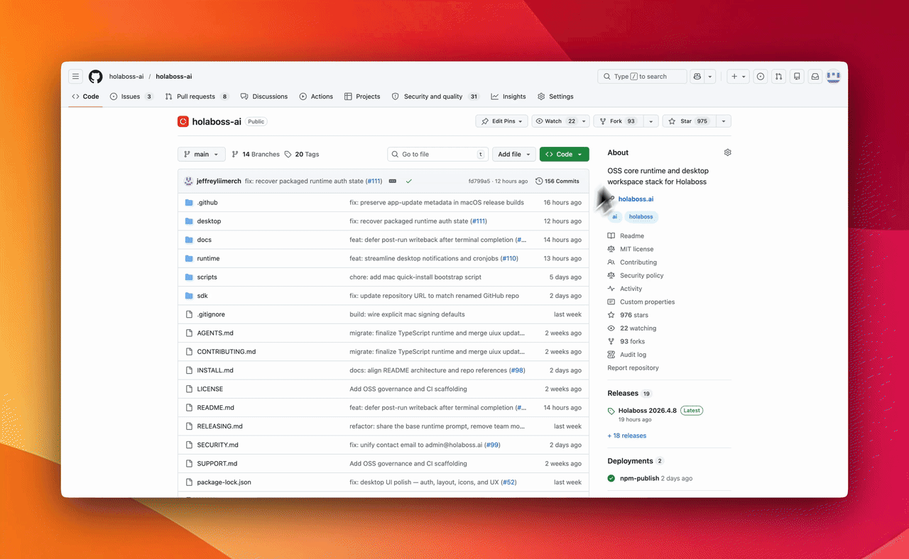

  

<strong>An Open Agent Computer for ANY digital work.</strong>

  
  
  
  
  
  

  
  

<strong>⭐ Help us reach more developers and grow the holaOS community. Star this repo!</strong>

  <a href="https://www.holaos.ai/?utm_source=github&utm_medium=oss&utm_campaign=hola_boss_oss&utm_content=readme_nav_website">Website</a> ·
  <a href="https://www.holaos.ai/docs/getting-started?utm_source=github&utm_medium=oss&utm_campaign=hola_boss_oss&utm_content=readme_nav_docs">Docs</a> ·
  <a href="https://www.holaos.ai/signin?utm_source=github&utm_medium=oss&utm_campaign=hola_boss_oss&utm_content=readme_nav_signin">Sign in</a> ·
  <a href="#quick-start">Quick Start</a>

# holaOS

holaOS is an open agent computer for any digital work. It reimagines the computer as a shared environment where humans and AI agents operate side by side—with full access to the same browser, files, and apps, like collaborating with a powerful teammate that continuously learns how to work better with you. Instead of working across disconnected tools and contexts, everything lives in one place where memory, execution, and goals remain coherent, so work doesn’t reset or lose state. Agents operate continuously within this environment, evolving over time while remaining fully inspectable, and can be shaped by you through roles and templates to support consistent, repeatable ways of working.

  

## Star the Repository

  

<strong>If holaOS is useful or interesting, a GitHub Star would be greatly appreciated.</strong>

